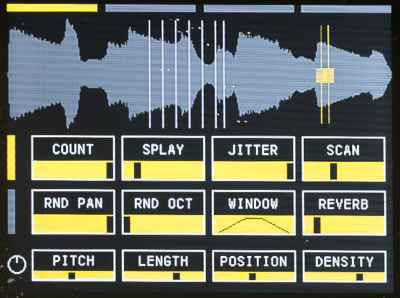
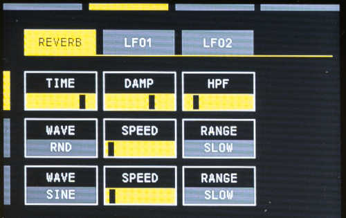
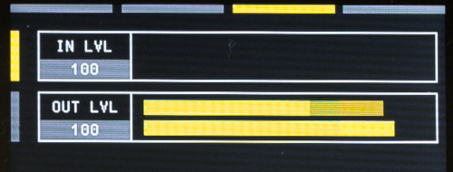
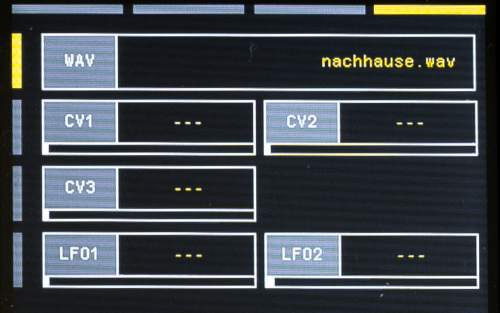

<h1>WYATT - Grainstorm</h1>

A Daisy Seed based Granular Synth/Effect - ported from the awesome ["Grainwaves"](https://github.com/TurpinL/Grainwaves)

## Features
- Sample length: 5 sec. Mono 16bit 48kHz
- Grainsize: 10ms to 3sec.
- Graincount: up to 20
- Random pan and octaves for each grain
- Editable grains window
- Reverb
- 2 LFOs (assignable to most of the parameter)
- Load wav file from SD Card (16bit 48kHz Mono)
- Individually assignable CV inputs
- Preset
- Auto calibration for the cv inputs

## UI
- **Save preset:** Shift + Func
- **Calibration:** Long press Func (5 sec)
- **Restore preset:** Shift + Top1
- **Change encoder increment size:** Shift + turn encoder (10 steps)
- With the four big top buttons you switch between the parameter pages
- Use the Up/Down buttons to select the row you wish to edit using the encoders.
- To start/stop recording, use the LED button below the Shift button.

## Parameter pages
### PAGE 1

- **COUNT:** 2-7 spawn points
- **SPLAY:** spreading the spawn points
- **JITTER:** random starting points of the grains
- **SCAN:** If the position knob is centered, scan can change the position of the span points
- **RND_PAN:** The grains spawn randomly in the stereo image
- **RND_OCT:** Random octaves of the grains (-2 to +2 octaves)
- **WINDOW:** Envelope of the grains
- **REVERB:** Reverb amount

The four knobs are routed to the following paramter
- **PITCH:** Pitch of the grains. Center original pitch, full ccw -2 octaves, full cw +2 octaves
- **LENGTH:** Length of the grains
- **POSITION:** Speed of the spawn points. Center = 0 
- **DENSITY:** Number of grains

### PAGE 2
 
**Reverb**
- **TIME:** Decay time
- **DAMP:** Lowpass filter
- **HPF:** Highpass filter

**LFO1**
- **WAVE:** waveform – Sine, Triangle, Saw, Ramp, Square, SmoothRandom, Random, PTRI, PSAW,PSQR
- **SPEED:** Frequency
- **RANGE:** Slow, Med, Fast

**LFO2**
- **WAVE:** waveform – Sine, Triangle, Saw, Ramp, Square, SmoothRandom, Random, PTRI, PSAW,PSQR
- **SPEED:** Frequency
- **RANGE:** Slow, Med, Fast

### PAGE 3
 
**VU-Meter**
- Input level, output level

### PAGE 4

- **WAV:** Load wav file from sd card – select and click the encoder to load (16bit Mono 48khz – have to be inside a folder „samples“ on root)
- **CV1-CV3:** Target parameter and attenuator
- **LFO1-LFO2:** Target parameter and attenuator

## ToDo
- [ ] Save recorded audio to sd card
- [ ] MIDI implementation
- [ ] Better fonts
- [ ] Load last selected wav file on startup
