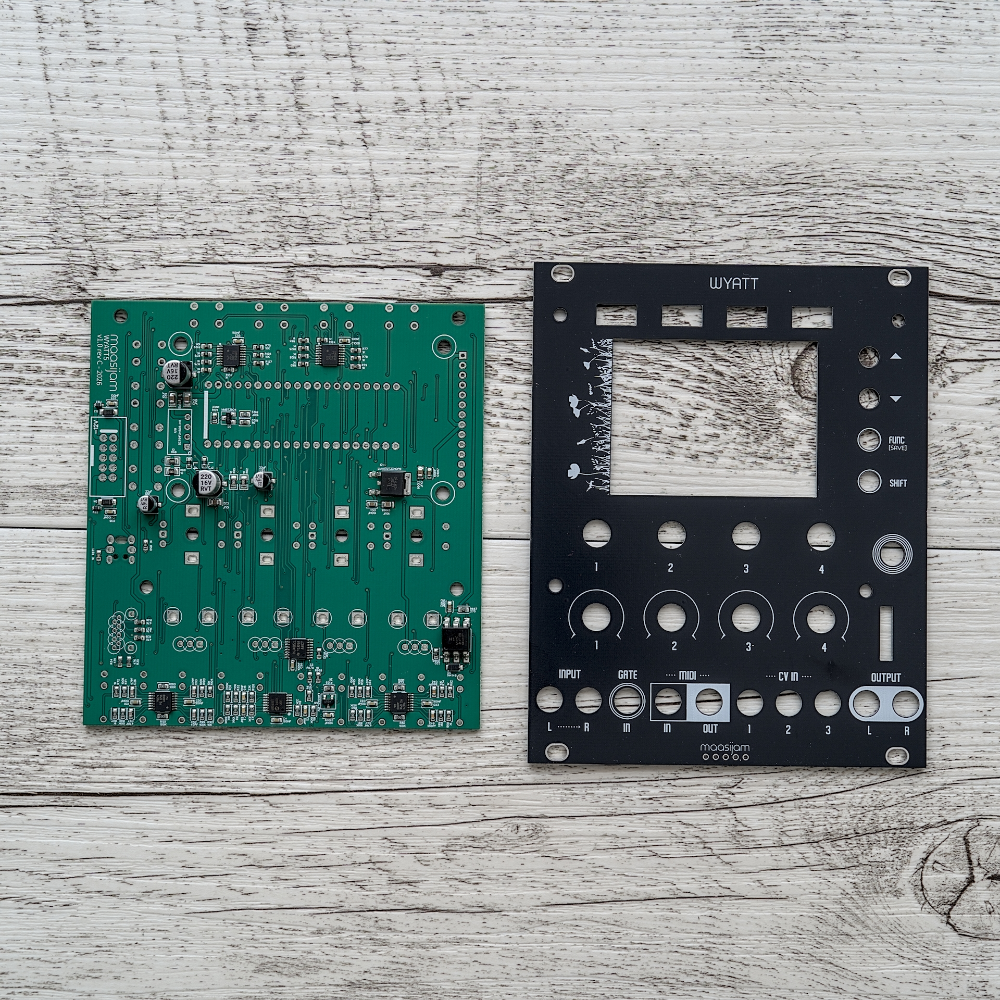
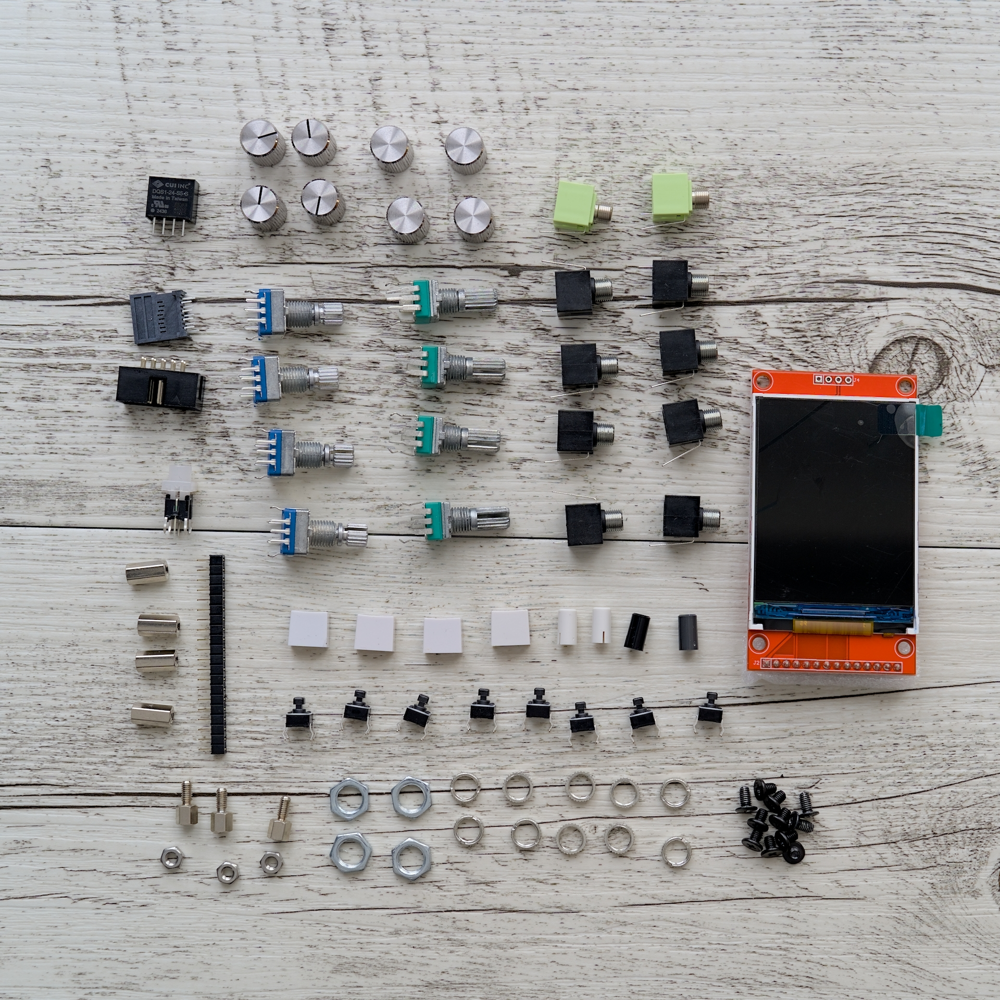

<h1>WYATT Hardware</h1>

> [!NOTE]
> This project is not suitable for beginners. You should have good soldering skills (lots of SMDs). Alternatively, however, you could use an assembly service (I had the whole thing assembled by JLCPCB - using the files in the "Gerber" folder).  Disclaimer: This is a DIY project. Use at your own risk. Only for non-commercial and non-profit uses.

