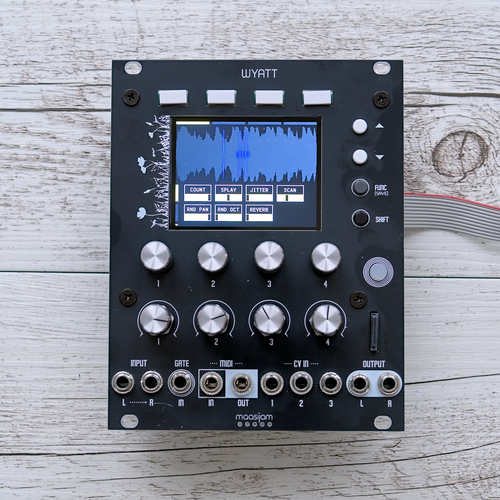
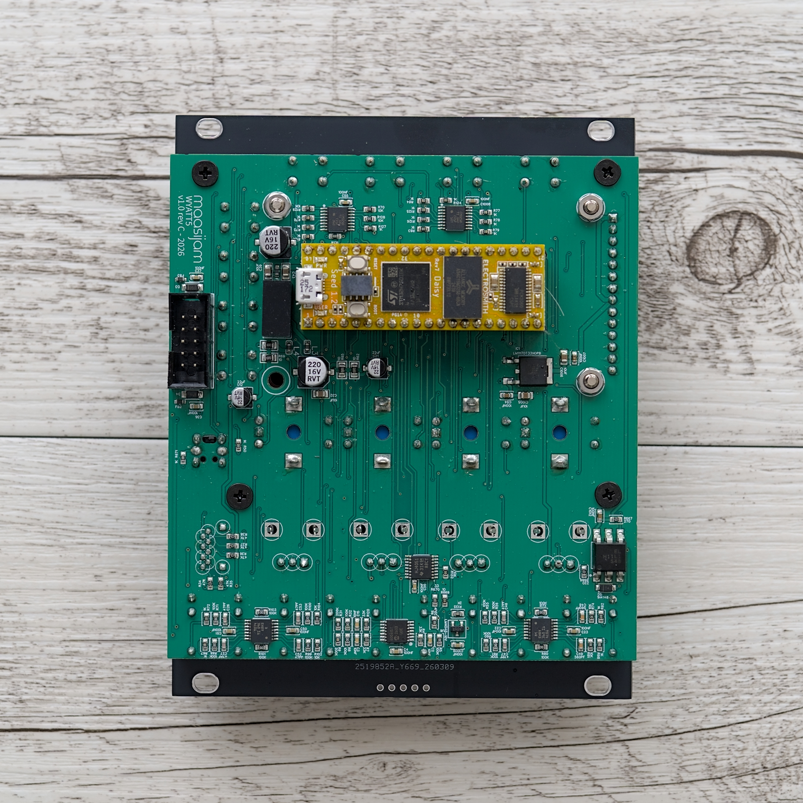

# WYATT - A Daisy Seed based Eurorack module

> [!NOTE]
> This is a DIY project. Use at your own risk.

## Features
- Daisy Seed based
- Big color tft (ili9341)
- 8 Push buttons
- 1 Button with red/green led
- 4 Encoder
- 4 Pots
- Stereo IO
- 1 Gate/Trig in
- Midi IO (TRS Type B)
- 3 CV ins
- Micro SD Card
 
 

> [!NOTE]
> For the TFT display to work correctly, you need to change the following line in libDaisy:
> https://github.com/electro-smith/libDaisy/blob/master/src/sys/system.cpp#L528 to MPU_InitStruct.Size = MPU_REGION_SIZE_256KB;

## Known Problems
+ The switch debouncing is sometimes a bit buggy. If you hold down a switch for an extended period, it triggers multiple times. This seems to be an issue related to the shift registers. I have already increased the "delay_ticks" in the shift register configuration; this improves the situation but doesn't solve the problem completely. If anyone has a tip, please feel free to post it under "Issues".

## Images

